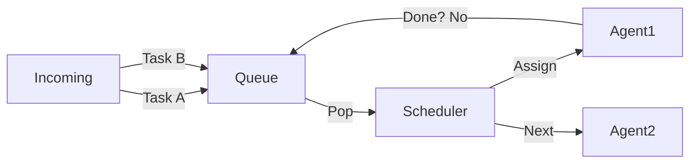

# Round-Robin Scheduler

> **Fair play for every agent.**

---

## 🧠 Mental Model

### The Problem
Agent A has 100 small tasks.
Agent B has 1 giant task.
If we process Agent A's tasks first (FIFO), Agent B waits forever (Starvation).
If we let Agent B run, it blocks the system.

### The Solution
**Round-Robin Scheduling**.
1.  **Queue**: Organize agents in a circle.
2.  **Quantum**: Give Agent A 100ms (or 1 task).
3.  **Preempt**: If time is up, move Agent A to the back of the line.
4.  **Next**: Give Agent B 100ms.

### When to use this
*   [x] Multi-tenant SaaS (Don't let one user hog the API).
*   [x] CPU Scheduling.
*   [x] Load Balancing across equal servers.

---

## 🏗️ Architecture

## ⚠️ Risks & Ethics

See [ETHICS.md](ETHICS.md).
- **Context Switching**: If the quantum is too small, agents spend all their time loading/unloading (Thrashing).
