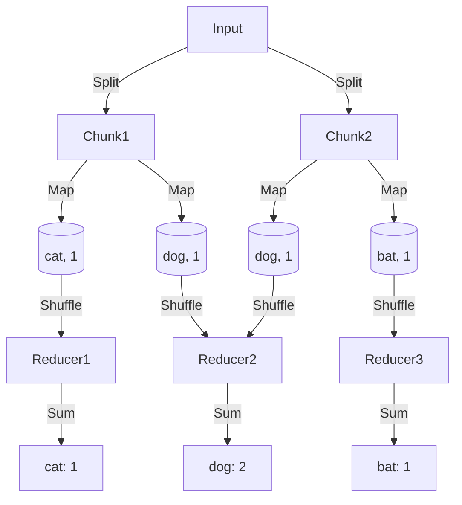

# Map-Reduce Pattern

> **Process big data by splitting it up.**

---

## 🧠 Mental Model

### The Problem
You have 10,000 text files. You want to count every word.
A single loop is too slow.
Loading everything into RAM crashes.

### The Solution
**Map-Reduce**.
1.  **Split**: Divide files into chunks.
2.  **Map**: Agents process chunks in parallel -> `(word, 1)`.
3.  **Shuffle**: Group by key -> `word: [1, 1, 1]`.
4.  **Reduce**: Sum up values -> `(word, 3)`.

### When to use this
*   [x] Log Analysis (Count error types).
*   [x] Search Indexing (Inverted Index).
*   [x] Distributing standard LLM tasks (Summarize 50 chapters, then summarize the summaries).

---

## 🏗️ Architecture

## ⚠️ Risks & Ethics

See [ETHICS.md](ETHICS.md).
- **Stragglers**: If one Mapper is slow, the whole job waits.
- **Skew**: If "the" appears 1M times and "antigravity" 1 time, the Reducer for "the" will crash.
