# Distributed Tracing Shim

> **Follow the life of a request across multiple agents.**

---

## 🧠 Mental Model

### The Problem
User says "Help".
Agent A calls Agent B. Agent B calls Database. Database fails.
Agent A receives "Error".
User asks "Why?". Log file just says "Error".
We need to stitch these events together.

### The Solution
**Distributed Tracing (OpenTelemetry style)**.
1.  **Trace ID**: A unique ID (`abc-123`) generated at the start.
2.  **Propagation**: Start -> Agent A (`Trace=abc-123`) -> Agent B (`Trace=abc-123`).
3.  **Span**: A specific operation ("Agent B thinking"). Has a parent span.
4.  **Visualize**: A waterfall chart showing where time went.

### When to use this
*   [x] Debugging latency (Why did it take 10s?).
*   [x] Root cause analysis (Who failed first?).
*   [x] Understanding async flows.

---

## 🏗️ Architecture

```mermaid
gantt
    title Request Trace: abc-123
    dateFormat s
    axisFormat %S
    
    User Request :a1, 0, 5s
    Agent A Plan :a2, 0, 1s
    Agent B Search :after a2, 2s
    Agent C Summarize :after a2, 1s
```

## ⚠️ Risks & Ethics

See [ETHICS.md](ETHICS.md).
- **Overhead**: Tracing adds CPU/Memory cost. Sampling (logging only 1% of requests) is common.
- **Data Leaks**: Don't log PII in trace tags (e.g., arguments passed to functions).
