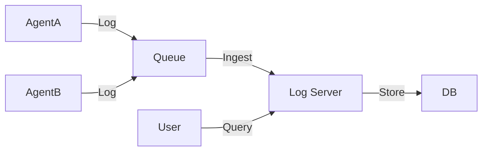

# Log Aggregation Service

> **One place to see all the errors.**

---

## 🧠 Mental Model

### The Problem
You have 50 agents running in parallel.
Agent 42 crashes.
You don't want to SSH into 50 containers to find `agent_42.log`.
"Grepping dead text files is not a strategy."

### The Solution
**Centralized Logging (ELK Stack / Splunk style)**.
1.  **Emit**: Agents print structured logs (`{"level": "ERROR", "msg": "..."}`).
2.  **Ship**: A sidecar or library sends these to a central collector.
3.  **Index**: The collector saves them.
4.  **Query**: "Show me all ERRORs from Service A in the last 10 minutes."

### When to use this
*   [x] Production systems with >1 service.
*   [x] Audit trails.
*   [x] Real-time monitoring.

---

## 🏗️ Architecture

## ⚠️ Risks & Ethics

See [ETHICS.md](ETHICS.md).
- **Log Flooding**: One bug causing an infinite error loop can fill the disk in seconds. (Need Rate Limiting).
- **Sensitive Data**: Logging passwords or PII in clear text.
