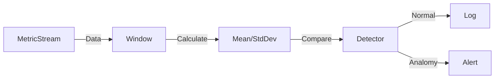

# Anomaly Detection Agent

> **"That graph looks weird."**

---

## 🧠 Mental Model

### The Problem
You have alerts for "CPU > 90%".
But what if CPU drops to 0%? Or memory oscillates wildly?
Static thresholds miss dynamic problems.

### The Solution
**Statistical Anomaly Detection (Z-Score)**.
1.  **Baseline**: Calculate the moving average and standard deviation of the last N data points.
2.  **Compare**: How many standard deviations away is the new point?
    *   $Z = \frac{x - \mu}{\sigma}$
3.  **Alert**: If $|Z| > 3$ (3 Sigma rule), it's a 99.7% outlier.

### When to use this
*   [x] Intrusion Detection (Unusual login times).
*   [x] Financial Fraud.
*   [x] Server Health Monitoring.

---

## 🏗️ Architecture

## ⚠️ Risks & Ethics

See [ETHICS.md](ETHICS.md).
- **Seasonality**: Traffic naturally drops at night. A simple Z-Score might flag "Normal Night" as "Low Traffic Anomaly".
- **Concept Drift**: If the baseline changes slowly (user growth), the model needs to adapt.
