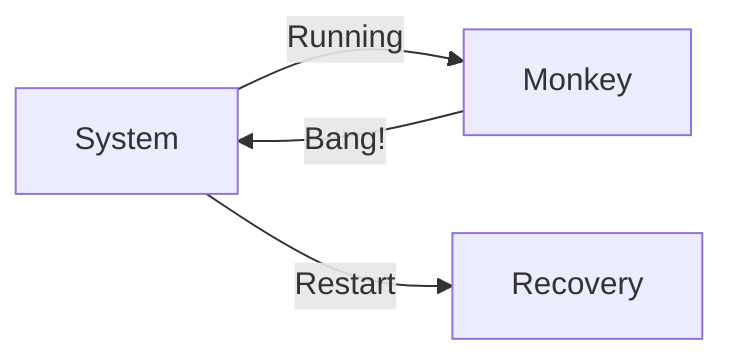

# Chaos Monkey Agent

> **"What doesn't kill you makes you stronger."**

---

## 🧠 Mental Model

### The Problem
Systems work fine in dev.
In prod, networks fail, disks fill up, and APIs timeout.
If you never test these failures, your first outage will be a disaster.

### The Solution
**Chaos Engineering**.
1.  **Inject Faults**: Randomly terminate processes, add latency, or throw exceptions.
2.  **Observe**: Does the system auto-recover? (See Project 25 Circuit Breaker).
3.  **Fix**: Uncover weak spots.

### When to use this
*   [x] Validating Retry Logic.
*   [x] Testing Load Balancer Failover.
*   [x] Ensuring data consistency during crashes.

---

## 🏗️ Architecture

## ⚠️ Risks & Ethics

See [ETHICS.md](ETHICS.md).
- **Production Risks**: Don't run this in Prod unless you are Netflix. Run in Staging.
- **Data Loss**: Ensure you have backups before simulating disk corruption.
