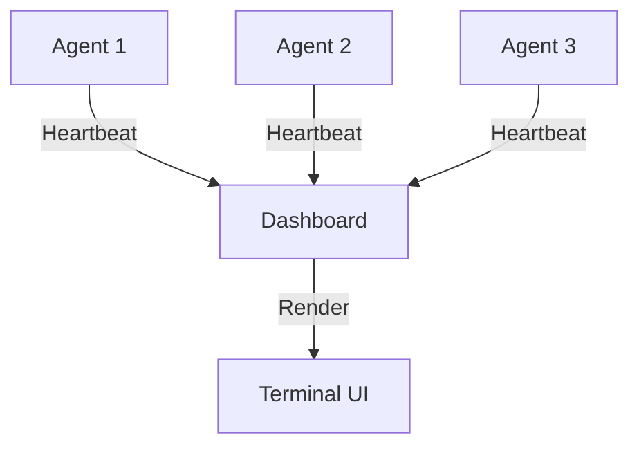

# Agent Observatory (Dashboard)

> **"If you can't measure it, you can't improve it."**

---

## 🧠 Mental Model

### The Problem
You have 50 agents running.
Agent 12 is stuck in a loop.
Agent 4 is erroring out.
You have no idea because you are looking at 50 different log files.

### The Solution
A **Centralized Dashboard** (Observatory).
It subscribes to status updates from all agents and renders a real-time view.
*   **Green**: Healthy
*   **Yellow**: High Latency
*   **Red**: Error/Dead

### Implementation
We will use Python's `rich` library to create a beautiful terminal dashboard.
Agents will "check in" via a shared `Queue` or `Pub/Sub`.

---

## 🏗️ Architecture

## 🛠️ Tech Stack
*   Python `rich` library (for UI).
*   `threading` (to simulate concurrent agents).
*   `queue` (for non-blocking communication).
