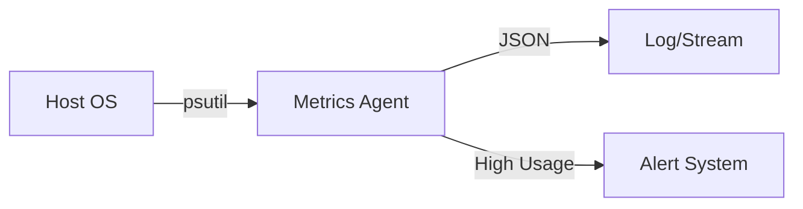

# System Metrics Collector Agent

> **"Know thyself (and thy server)."**

---

## 🧠 Mental Model

### The Problem
Agents are software. Software runs on hardware.
If your server runs out of RAM, your smart agents become dead agents.
LLMs are memory hungry. Vector DBs are CPU hungry.

### The Solution
A **Metrics Collector Agent** that sits on the host.
It polls system resources (CPU, RAM, Disk, Network) and emits them as structured telemetry.
This is the foundational inputs for autoscalers (Project 65).

### Key Concepts
1.  **Polling Interval**: How often to check? (Too fast = overhead, Too slow = miss spikes).
2.  **Normalization**: Reporting % vs raw bytes.
3.  **Alerting Thresholds**: "If RAM > 90%, restart."

### Architecture

## 🛠️ Tech Stack
*   `psutil` (Python System and Process Utilities) - *Standard for this*.
*   `platform` (OS details).
*   `json` (Data format).
