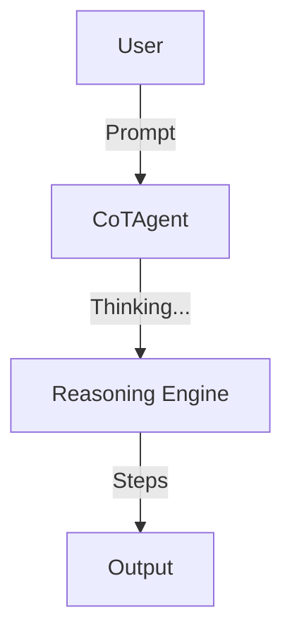

# Explainability Agent (XAI)

> **"Show your work."**

---

## 🧠 Mental Model

### The Problem
Neural Networks are "Black Boxes".
Users don't trust answers they can't understand.
"Why was my loan denied?" -> "Score: 0.4". (Not helpful).

### The Solution
**Chain-of-Thought (CoT) & Feature Importance**.
1.  **CoT**: Force the agent to output reasoning steps `<thought>...</thought>`.
2.  **Attribution**: Highlighting which words in the prompt influenced the output (simulated SHAP).

### Architecture

## 🛠️ Tech Stack
*   String parsing (Extracting thoughts).
*   Simulation of "Attention Weights".
