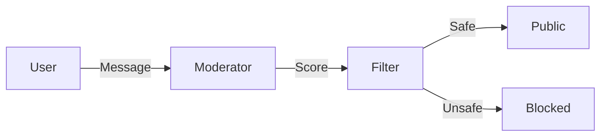

# Content Moderator Agent

> **"Keep the internet clean."**

---

## 🧠 Mental Model

### The Problem
User Generated Content (UGC) is toxic.
Hate speech, violence, and harassment needs to be filtered instantly.
Manual review is too slow.

### The Solution
A **Classification Agent**.
It scores text on multiple dimensions:
1.  **Toxicity**
2.  **Severe Toxicity**
3.  **Obscenity**
4.  **Threat**

### Architecture

## 🛠️ Tech Stack
*   `Math` (Scoring logic).
*   Keyword/Heuristic analysis (for demo).
