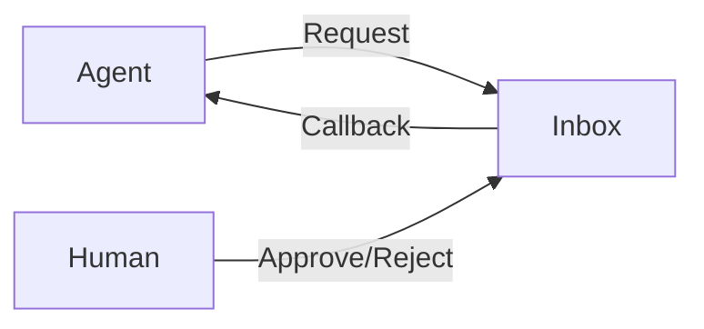

# Human-in-the-Loop (HITL) Agent

> **"Trust, but verify (again)."**

---

## 🧠 Mental Model

### The Problem
Agents are fast but error-prone.
For high-stakes actions (sending money, deploying code), you need a human to say "Yes".
The agent should pause, wait, and resume.

### The Solution
A **Workflow Engine with Suspension**.
1.  **Agent**: Do work.
2.  **Agent**: "I need approval." -> *Suspend*.
3.  **Human**: "Approved." -> *Resume*.
4.  **Agent**: Execute.

### Architecture

## 🛠️ Tech Stack
*   `threading` / `Event` (To simulate pausing).
*   `input()` (For human interaction).
